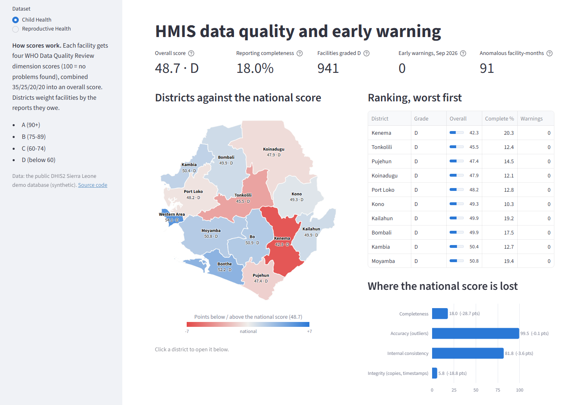
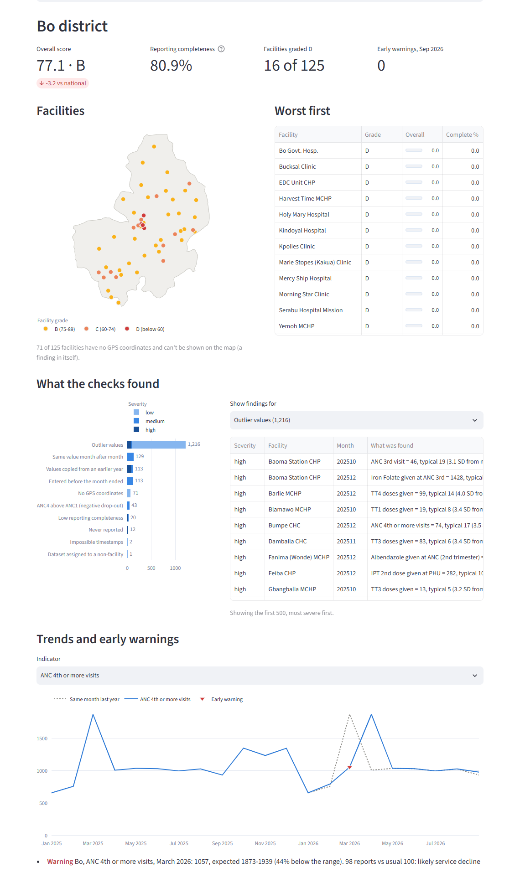

# HMIS Data Quality & Early-Warning Platform

End-to-end pipeline that pulls routine health data from DHIS2, scores it against the
WHO Data Quality Review framework, detects anomalies, forecasts key indicators and
shows the results on an interactive map dashboard.

> Work in progress — built in stages. See the roadmap below.

## Roadmap

1. [x] Foundation: project layout, config, DHIS2 extraction client
2. [x] Data lake: S3-compatible object store (SeaweedFS), bronze layer
3. [x] PySpark transforms: silver and gold tables
4. [x] Data quality engine: WHO DQR metrics at scale
5. [x] ML: forecasting vs. baselines, anomaly detection, early warning
6. [x] Dashboard: district map and drill-down (Streamlit, in Docker)
7. [ ] NiFi ingestion flow
8. [ ] Kubernetes deployment and CI

## Local setup

Requires Python 3.11+ and Docker Desktop.

```bash
python -m venv .venv
.venv\Scripts\activate          # Windows
pip install -e ".[dev]"
copy .env.example .env          # then fill in the values
docker compose up -d            # start the local S3 data lake and the dashboard
pytest                          # unit tests + lake integration test
```

Local addresses once it's running:

| What | Address |
|---|---|
| Dashboard | http://localhost:8501 |
| Lake S3 API (for code) | http://localhost:8333 |
| Lake file browser | http://localhost:18888 |
| Lake cluster status | http://localhost:19333 |

Windows reserves blocks of ports (Hyper-V/WSL) that can change after a reboot. If
one of these is taken, pick another in `.env` (`HMIS_DASHBOARD_PORT`,
`HMIS_S3_PORT`, `HMIS_FILER_PORT`, `HMIS_MASTER_PORT`; see `.env.example`).

## Usage

```bash
hmis-dq ping                    # check the DHIS2 connection
hmis-dq extract --start 2023-01 # DHIS2 -> bronze bucket (resumable)
hmis-dq lake status             # what's in the lake
hmis-dq lake upload             # copy a local data/raw folder into the lake
```

Spark jobs run in a container next to the lake:

```bash
docker compose build spark spark-test
docker compose run --rm spark hmis-dq spark build   # bronze -> silver -> gold -> DQ
docker compose run --rm spark-test                  # Spark unit tests (Linux)
```

## Explore the data

[`notebooks/tour.ipynb`](notebooks/tour.ipynb) follows one facility and one indicator
through every layer, from DHIS2's raw JSON to the facility's data quality score, with
charts. It reads the lake with DuckDB, so it runs on any laptop without Spark:

```bash
pip install -e ".[explore]"
docker compose up -d        # the lake must be running
```

Then open the notebook in VS Code or Jupyter, pick the `.venv` kernel and **Run All**.
Change `FACILITY`, `INDICATOR` or `DATASET` in the first cell to explore anything else.

## Data quality engine

Every check writes to one `findings` table (check, WHO DQR dimension, severity,
district / facility / indicator / period, value, expected value, score, and a
plain-language message). Thresholds live in one place
([`rules.py`](src/hmis_dq/spark/dq/rules.py)) with their source.

| WHO DQR dimension | Checks |
|---|---|
| Completeness | facilities that never reported; facilities below the 80% benchmark |
| Outliers | 3 SD from the facility's own mean, and modified z-score (median/MAD) >= 3.5 |
| Internal consistency | negative Penta1->Penta3 and ANC1->ANC4 drop-out per year; OPV1/Penta1 ratio vs national |
| Consistency over time | district totals vs the mean of up to 3 previous years, same months, +/-33% |
| System | values identical to the same month 1-2 years earlier; same value months in a row; impossible timestamps; reports entered before the month ended; datasets assigned to non-facilities; facilities without coordinates |

Each facility and district gets a 0-100 score per dimension (completeness,
accuracy, consistency, integrity) and an overall grade. Every score is
`100 x (1 - share affected)`, so it can be explained from counts, and a dimension
that can't be measured is left out rather than counted as perfect.

## Data quality findings (DHIS2 demo database)

Run over 1,021,137 values from 1,169 facilities, January 2023 to September 2026.

| | Child Health | Reproductive Health |
|---|---|---|
| Reporting completeness | **18.0%** (9,357 of 51,885 reports) | **84.1%** (20,383 of 24,234) |
| Timeliness | unknown (see below) | unknown |
| Overall score | **48.7 (D)** | **80.3 (B)** |

1. **Copied, not counted.** 69-92% of each facility's monthly values are identical
   to the same month one year earlier, and 70-77% to two years earlier; some
   facilities alternate between two copied years (1,755 facility-years flagged). This is also
   why *consistency over time* finds nothing: totals are stable because they are
   copies. A check that looks perfect on its own is explained by another.
2. **Four in five facilities don't report Child Health.** 1,161 facilities are
   assigned the dataset; only 237 ever report it. District totals rest on
   fewer than a fifth of facilities.
3. **Timeliness can't be measured.** Every one of the 29,740 received reports has an
   entry date before its month ended (up to 16 years early), and 40% of values were
   "last updated" before they were created. Rather than report a misleading 100%
   on time, timeliness is marked unknown.
4. **Facility errors hidden by district totals.** 366 facility-years report more
   Penta3 than Penta1 doses, or more ANC4 than ANC1 visits (negative drop-out);
   no district total shows it.
5. **Configuration issues.** 5 dataset assignments point at districts or the whole
   country instead of facilities, and 48% of facilities have no GPS coordinates.

## Forecasting (honest baselines)

`hmis-dq ml backtest` replays the last 12 months for 91 district x tracer-indicator
series: for each month, every model is trained only on earlier data and asked to
predict it. Models are judged by **skill** against the standard benchmark,
"same month last year": `1 - MAE(model) / MAE(seasonal naive)`, so above 0 beats it.

| Model | Child Health: median skill | Reproductive Health: median skill |
|---|---|---|
| seasonal naive (same month last year) | **0.00** (benchmark, 2.3% error) | **0.00** (2.1% error) |
| same month two years earlier | -0.31 | - |
| Holt-Winters exponential smoothing | -0.31 | - (needs 2 years of history) |
| gradient boosting on the change from last year | -0.78 | -1.68 |
| gradient boosting on lag features | -1.29 | -2.92 |
| mean of last 3 months | -5.86 | -4.75 |
| last month | -7.39 | -4.27 |

No model beats the benchmark, and that is the finding. Routine monthly counts
normally differ 10-20% from the year before; here last year predicts this year
to within ~2%, because most values are copies (see the data quality findings).
When the data is a copy, the copy is the best forecast, and every model that
learns from history can only add noise. Gradient boosting improved most when
it was set up to predict the *change* from last year rather than the value, the
standard way to build the benchmark into a model.

The same backtest is what decides which model to trust on real data.

## Anomaly detection (what the rules miss)

`hmis-dq ml anomalies` looks at each facility-month as a *profile* across nine
immunisation antigens. Each antigen is expressed relative to the facility's own
usual level, so facilities compare by shape, not size, and an Isolation Forest
flags the most unusual 1%, with a plain-language reason.

On 9,289 facility-months it flagged 91, from just 18 facilities:

| Pattern | Rules rated high | Rules rated low | **Rules missed** |
|---|---|---|---|
| most antigens far **below** usual | 0 | 16 | **30** |
| most antigens far **above** usual | 4 | 19 | 0 |
| antigens out of step | 7 | 8 | 7 |

The model adds most where it matters most: **drops** across several antigens at
once, the signature of a stock-out or missed outreach session. Single-indicator
outlier checks are biased towards spikes (a count can't fall below zero, so a drop
rarely reaches 3 SD), while several antigens falling together is rare enough for the
forest to isolate. It also upgrades findings the rules rated low, e.g. Measles 684
and Penta3 557 in one month at a facility that usually reports 10-20.

A first version missed a planted single-antigen typo (ranked 159th): an Isolation
Forest splits on one random column at a time. Adding three summaries of each profile
(mean, largest and spread of the deviations) fixed it, and the tests plant known
problems to keep it that way.

## Early warning

`hmis-dq ml early-warning` checks the latest month of every district x tracer
indicator against an **expected range**: the best forecaster from the backtest
(same month last year), widened by how wrong that forecast has actually been for
the indicator in earlier months (5th-95th percentile of past errors, pooled across
districts, never including the month being checked). Only shortfalls are flagged:
this is about service disruption.

Each warning separates two very different causes, using the district's reports
received that month against its usual level:

> *Bo, ANC 4th or more visits, March 2026: 1057, expected 1873-1939 (44% below the
> range). 98 reports vs usual 100: likely **service decline***

> *... fewer reports than usual: likely **reporting drop***

It also lists facilities with a multi-antigen drop (from the anomaly model) in the
last three months, and replays the check over the last 12 months as if each had been
the latest, so a quiet current month can be told apart from a check that can't fire:

| Month | Warnings | Service decline | Reporting drop |
|---|---|---|---|
| 2025-10 | 3 | 3 | 0 |
| 2026-01 | 1 | 1 | 0 |
| 2026-02 | 1 | 1 | 0 |
| 2026-03 | 45 | 45 | 0 |
| 2026-04 | 6 | 4 | 2 |
| 2026-05 to 2026-09 | 0 | - | - |

The ranges are narrow on the demo data because they are learned from past forecast
errors, and copied values make those errors tiny; on real data they widen
accordingly. A 5th-percentile bound also means about 1 in 20 normal district-months
falls below it by chance, which is why small shortfalls are graded medium.

## Dashboard

`docker compose up -d` starts a Streamlit dashboard next to the lake, at
http://localhost:8501. It reads the gold and ML tables straight from the lake with
DuckDB (no Spark), so it runs in an image of its own
(`docker/dashboard.Dockerfile`), the same one the Kubernetes deployment will use.



**National view.** Headline scores for the chosen dataset, a map of districts and
a ranking, worst first. Every Child Health district is graded D on the demo data,
so colouring by grade would paint the map one flat red; the map shows each
district's distance from the national score instead (red below, blue above), and
every district is labelled with its score and grade, so colour is never needed to
read it. A bar chart shows where the national score is lost: for Child Health,
completeness costs 28.7 of the 100 points and integrity (copied values) 18.8.



**District drill-down.** Click a district on the map (or pick it) to see:

- its facilities on a map coloured by grade, with a count of those that can't be
  placed because they have no GPS coordinates (63 of 122 in Kenema), and a table,
  worst first;
- what the checks found, by check and severity, with the message behind each
  finding (*"Penta3 doses given (986) exceeds Penta1 doses given (982)"*);
- monthly trends of the tracer indicators against the same month last year, with
  early-warning months marked and explained;
- facility-months flagged by the anomaly model, including those the rules missed.

To work on the dashboard code, run it from the virtual environment instead of the
container (code changes show up without rebuilding an image):

```bash
hmis-dq dashboard --port 8502   # 8501 is taken by the container
docker compose up -d --build dashboard   # rebuild the container after changes
```

## Lake layout

| Layer | Bucket | Contents |
|---|---|---|
| Bronze | `bronze` | DHIS2 responses exactly as received (gzipped JSON) plus lineage metadata |
| Silver | `silver` | Typed Parquet: `data_values` (with a parse status per value), org units with hierarchy and coordinates, data elements, datasets, dataset assignments |
| Gold | `gold` | `facility_month`, `reporting` (one row per *expected* report, received or not), `district_month` with completeness |

Extraction pulls one chunk per dataset x district x month, in parallel. Re-runs
skip chunks already stored and re-fetch only the last few months, where late
reports still arrive.

## Data

Development uses the public DHIS2 demo database (synthetic data modelled on
Sierra Leone). No real patient or national HMIS data is stored in this repository.

## License

[MIT](LICENSE) © 2026 Kwenev Stephen. A personal project built on the public DHIS2 demo
server; not affiliated with or endorsed by any organisation.
